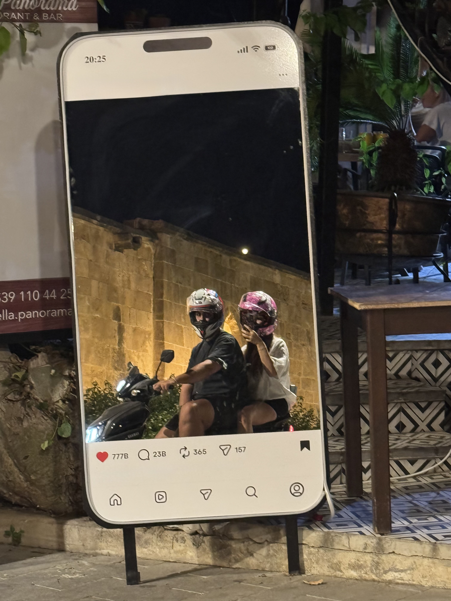

<!DOCTYPE html>
<html lang="tr">
<head>
    <meta charset="UTF-8">
    <meta name="viewport" content="width=device-width, initial-scale=1.0">
    <title>Sadece Bizim İçin ❤️</title>
    
</head>
<body>

    

        
🔒❤️

        <h1>Giriş Yap</h1>
        
Lütfen sadece bizim bildiğimiz o şifreyi gir sevgilim... 🥰

        <input type="password" id="passwordInput" placeholder="Şifreniz...">
         
        <button onclick="checkPassword()">Giriş Yap</button>
    

    

        
❤️

        
        <h1>Selin & Berk</h1> 

        
Hayatımın en güzel detayına... İyi ki varsın, iyi ki hayatımdasın. Bu siteyi tamamen senin için hazırladım. Seni çok seviyorum! 💕

        
        

            
            
            
            
            
            
            
            
            
        

    

    
</body>
</html>
